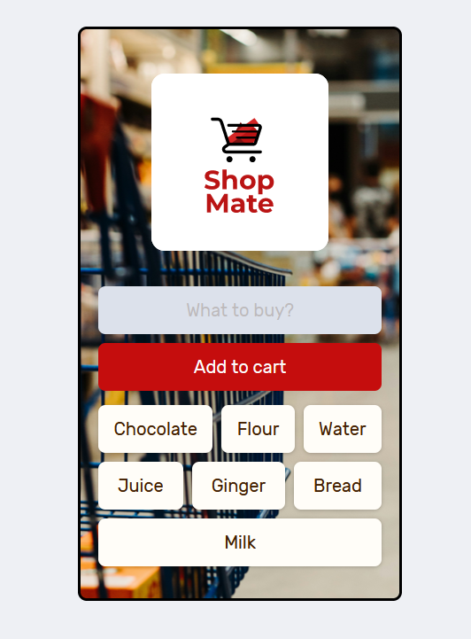

# Shop Mate

 
Welcome to the Shop Mate app! This project can be deployed onto mobile devices using the netlify URL provided.
It helps you manage your shopping list so that you won't forget to buy anything when grocery shopping.

## Demo
Try it out: https://shop-mate-telmen.netlify.app/

## How to Use
- Type ingredients you want to add and press 'Add to cart'
- To delete an item double-click it
